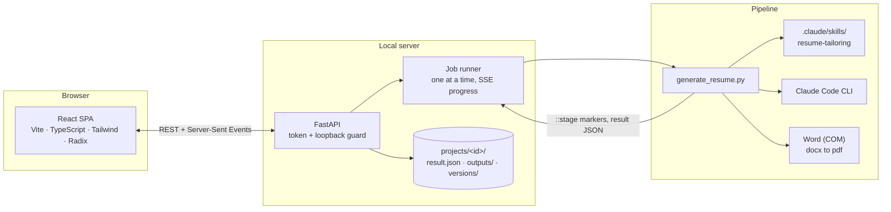

# Contributing and internals

This page is for people changing the code. If you just want to use Resume Studio,
the [README](README.md) is all you need.

## Setup for development

You need Python 3.10+ and, only for changing the web app, Node.js 20+.

```bash
pip install -r requirements-dev.txt
```
```bash
python -m pytest -q
```
```bash
cd webapp/frontend && npm install && npm run check
```

- `npm run check` runs TypeScript, ESLint, and Vitest.
- `npm run gen:api` regenerates `src/lib/api-schema.d.ts` from the server's Pydantic
  models, so frontend and backend types can't drift.
- `python scripts/make_template_previews.py` re-renders the template thumbnails
  (needs Word).
- `python scripts/capture_screenshots.py` retakes these screenshots against a
  running demo workspace and fails if any page scrolls sideways on a phone.

No test makes a Claude call; the API tests swap in a fake pipeline script.


The web app is shipped prebuilt in `webapp/frontend/dist` so that end users do not
need Node.js. **After changing anything in `webapp/frontend/src`, run `npm run build`
and commit the updated `dist/`** (CI fails if it is stale). The launcher rebuilds
automatically for anyone who has run `npm install` (a `node_modules` folder exists).

Before committing, install the safety hook once. It blocks resumes, `.env`, API keys,
and project folders from being committed:

```bash
python scripts/check_no_personal_data.py --install-hook
```

## How it works



- **The pipeline stays the single source of truth.** The app keeps your inputs in
  the exact files the command-line pipeline reads (`resume_input/in_profile*.docx`,
  `in_resume*.docx`, `fact_bank.yaml`, `do_not_claim.txt`), and runs
  `generate_resume.py` as a subprocess for every generation and re-render. The
  tailoring rules live only in the `resume-tailoring` skill.
- **Generation** is a drafting call plus a narrow JSON transcription call, followed by
  deterministic validation (citations, cross-employer mentions, numbers, em dashes,
  the never-claim list, keyword coverage). The result is saved as editable JSON.
- **Re-rendering** (`--render-json`) re-runs the same guards on your edited content
  and writes the files without calling Claude, so template switches and hand edits
  are instant and free.
- **Security for a local app:** the server binds to 127.0.0.1, rejects non-loopback
  Host headers (DNS rebinding), and requires a per-launch token on every API call.

Code map: `studio/` (API, project store, resume ingestion, fact bank, live linting,
job runner), `webapp/frontend/` (React app), `generate_resume.py` (pipeline),
`launcher.py` and `Launch Resume Studio.bat` (startup). See [CLAUDE.md](CLAUDE.md) for
internals.

## Command-line use

The original CLI still works on its own, with `resume_input/` as the inputs and
`resume_create/` / `resume_archive/` as the outputs:

```bash
python generate_resume.py
```

| Flag | What it does |
|------|--------------|
| `--job PATH` | Tailor to this posting instead of the newest `resume_input/in_job*` file |
| `--profile`, `--resume`, `--fact-bank`, `--deny` | Use these input files instead of the defaults |
| `--template {classic,modern,compact}` | Resume layout (default: classic) |
| `--cover-letter` | Also write a cover letter, held to the same citation and never-claim checks |
| `--out-dir`, `--archive-dir` | Where outputs and superseded outputs go |
| `--result-json PATH` | Also save the structured, editable result |
| `--render-json PATH` | Re-validate and render a saved result without calling Claude |
| `--model M`, `--effort E` | Override `CLAUDE_MODEL` / `CLAUDE_EFFORT` |
| `--no-pdf`, `--dry-run`, `--archive-job` | Skip PDF export / write nothing / archive the posting after a run |

Optional inputs: `resume_input/fact_bank.yaml` (draft it with
`python build_fact_bank.py`, then edit by hand or in the app) and `do_not_claim.txt`
(one case-insensitive regex per line). Optional `.env` settings: `CLAUDE_MODEL`,
`CLAUDE_EFFORT`, `CLAUDE_TIMEOUT`.
