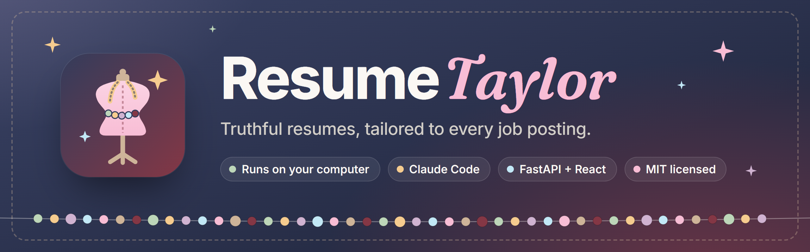
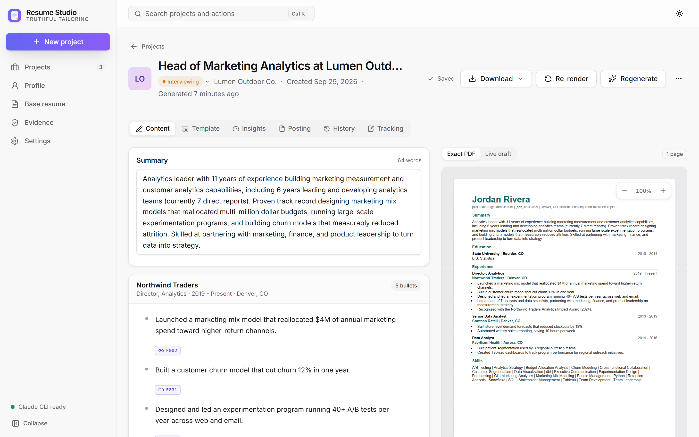
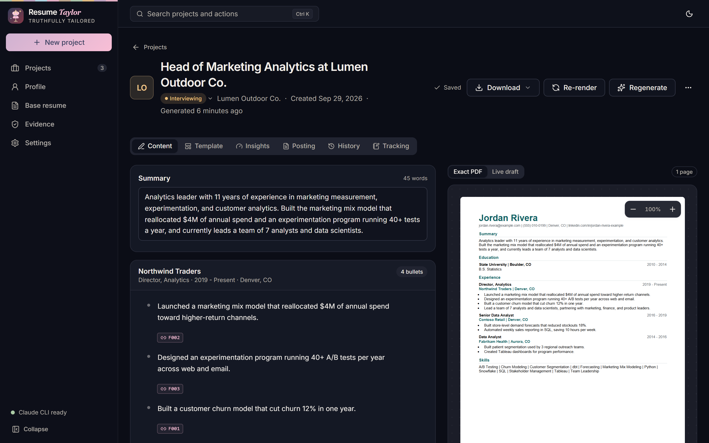
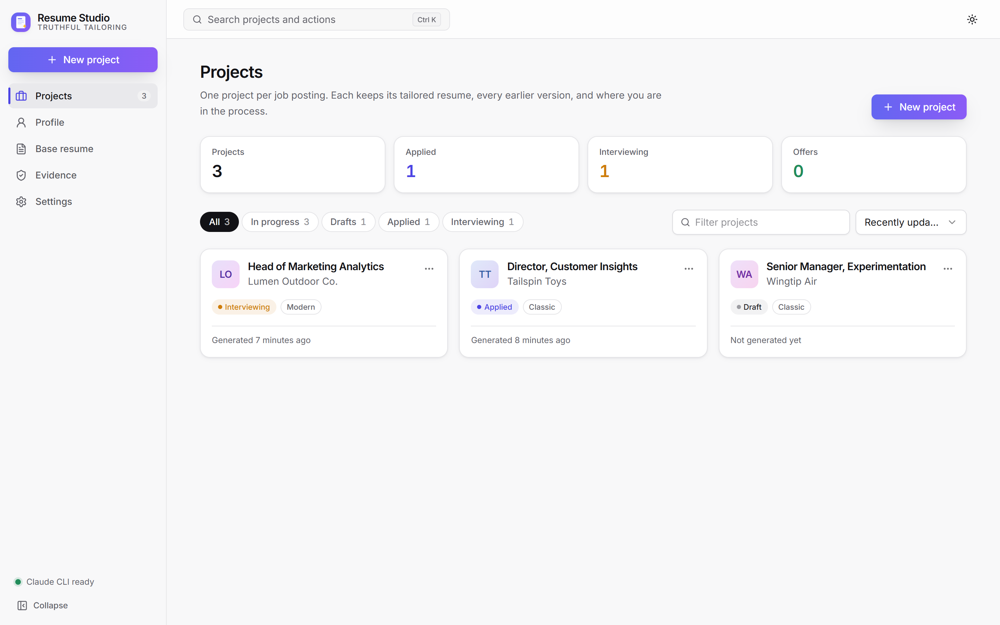
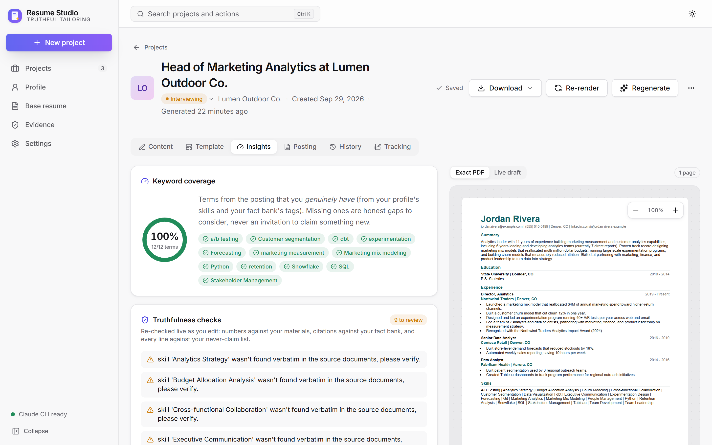
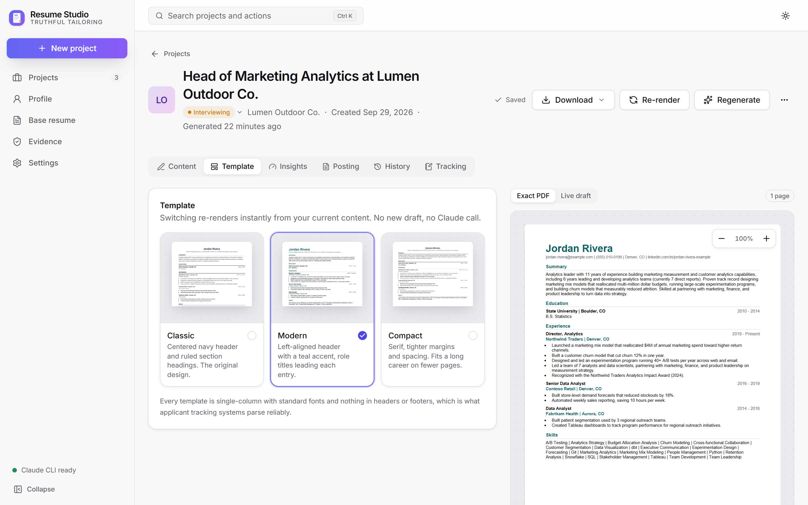
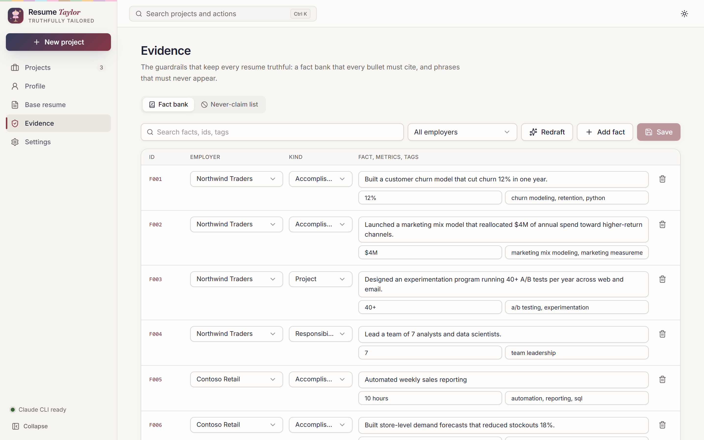

  

  
  
  
  
  
  
  

  <a href="#get-started-windows-about-10-minutes">Get started</a> ·
  <a href="#what-it-does">Features</a> ·
  <a href="#your-privacy">Privacy</a> ·
  <a href="#troubleshooting">Troubleshooting</a> ·
  <a href="CONTRIBUTING.md">Contributing</a>

**Resume Taylor tailors your resume to each job, and only with what's true.** Give it the
career history you already have (a resume plus a profile of accomplishments) and a job
posting. Claude selects, orders, and rephrases your real experience for that role, then
deterministic checks verify every number, citation, and claim before a single file is
written. Everything runs on your computer; generation uses your Claude subscription through
the Claude Code CLI.

  
  

*Screenshots use a fictional demo persona (`backend/src/resume_taylor/sample_data/demo_data.py`).*

## Get started (Windows, about 10 minutes)

You do not need to know how to code. You need a Windows PC, an internet connection,
and either a **Claude subscription** (Pro or Max) or an **Anthropic API key**.

### 1. Download it

1. On this GitHub page click the green **Code** button, then **Download ZIP**.
2. Right-click the downloaded ZIP, choose **Extract All**, and pick a simple folder
   such as `C:\ResumeTaylor`. Avoid OneDrive and "Program Files".

*Want your own copy on GitHub instead?* Click **Fork** (top right), then download the ZIP
from **your** fork. Keep your fork **private** if you plan to change files. You do not
have to, because your resumes and job postings are never stored in this folder (see
[Your privacy](#your-privacy)).

### 2. Start it

Double-click **`Launch Resume Taylor.bat`**.

- If Windows says "Windows protected your PC", click **More info**, then **Run anyway**.
  (That message appears for any program that is not from the Microsoft Store.)
- The first time, it sets everything up for you and asks a few yes/no questions. Press
  **Y** to each:
  1. Install Python (only if you do not have it).
  2. Install the Claude tool (only if you do not have it).
  3. Sign in to Claude (a browser window opens; log in and come back).
- This takes 2 to 5 minutes once. Next time it opens in seconds.
- Your browser opens Resume Taylor. **Keep the black window open** while you use the app,
  and close it to stop.

### 3. Sign in (choose one)

- **Claude subscription (recommended).** The launcher offers to sign you in on first run.
  To do it later, open a terminal and run `claude auth login`.
- **Anthropic API key.** In the app go to **Settings, Claude sign-in** and paste a key
  that starts with `sk-ant-`. Or open the file named `.env` in the Resume Taylor folder,
  remove the `#` at the start of the `ANTHROPIC_API_KEY=` line, paste your key after the
  `=`, and save. API use is billed per use by Anthropic; a subscription is not.

### 4. Look around, then make it yours

- Click **Try it with sample data** on the welcome screen to explore a made-up applicant
  (Jordan Rivera) with three example jobs. Nothing personal, and no Claude use needed to look
  around. When you are done, click **Clear sample data** in the banner.
- Or click **Get started**, upload the resume you already have (PDF or Word), confirm your
  profile, and paste your first job posting.

**Nice extras:** double-click `Create Desktop Shortcut.bat` for a desktop icon.
Microsoft Word is used for PDF export; without it you still get Word (`.docx`) files.

### Updating

Double-click `Update.bat` (if you used `git clone`), or download the new ZIP and unzip it
to a new folder. Your data is kept outside the code folder, so an update never touches it.

**Coming from Resume Studio?** That was this app's old name. Your data folder
(`%LOCALAPPDATA%\ResumeStudio`) is moved to `%LOCALAPPDATA%\ResumeTaylor` the first time the new
version starts, and `Update.bat` replaces an old "Resume Studio" desktop shortcut.

## What it does

- **Paste a job posting, get a tailored resume.** A project per application keeps the
  posting, the tailored resume (Word and PDF), every earlier version, and your
  application status and notes.
- **Nothing is invented.** Employers, titles, and dates are copied from your base
  resume exactly. Claude only selects, orders, and rephrases material that exists in
  your own documents, and deterministic checks enforce it:
  - every bullet cites the fact-bank facts it is built from, and a bullet that
    borrows another employer's fact is dropped;
  - numbers are checked against your materials;
  - a never-claim list (credentials, role identities, tools you don't use) blocks
    the render outright.
- **Edit with live guardrails.** Drag bullets to reorder, rewrite freely, and see
  flagged lines while you type. Ctrl+S re-renders the Word and PDF files in seconds,
  with no new Claude call.
- **Three ATS-safe templates.** Classic, Modern, and Compact are all single column,
  with standard fonts and nothing in headers or footers. Switching is instant.
- **See how well it matches.** Keyword coverage lists the posting's terms that you
  genuinely have, and which of them the resume uses. Missing terms are honest gaps,
  never prompts to claim something new.
- **Upload any resume.** PDF or Word. It is parsed deterministically (with an
  optional one-shot Claude extraction for unusual layouts), and anything not found
  word-for-word in your file is flagged for review before it's saved.
- **Day and night themes**, a Ctrl+K command palette, background jobs with live
  progress, version compare and restore, and a setup wizard.

  
  

  
  

## Your privacy

Resume Taylor runs only on your computer. The one thing that leaves it is the text sent to
Claude when you press Generate.

- **Your resumes, profile, job postings, and the companies you apply to are stored in
  `%LOCALAPPDATA%\ResumeTaylor`** (Settings shows the exact folder, with buttons to open it and
  to back it up). That folder is outside this code folder, so downloading, updating, forking, or
  running `git add .` cannot upload it.
- Your API key (if you use one) is kept in that same folder, is never shown back in the app,
  and is not written to logs.
- Extra protection for anyone who changes the code: `.gitignore` blocks personal files, and
  `python scripts/check_no_personal_data.py --install-hook` adds a pre-commit check that refuses
  to commit resumes, `.env`, or keys. See [SECURITY.md](SECURITY.md).
- The sample data and screenshots use a made-up person.

## Troubleshooting

Double-click **`Doctor.bat`** for a plain-English checklist. It hides your user name, so it is
safe to paste into a bug report.

| What you see | What to do |
|---|---|
| "Python was not found" and the install failed | Install Python from python.org, tick **Add python.exe to PATH**, run the launcher again |
| Windows blocks the file | **More info**, then **Run anyway** |
| "Not signed in to Claude yet" banner | Run `claude auth login` in a terminal, or paste an API key in **Settings** |
| "The Claude Code CLI wasn't found" | Close the window, double-click the launcher again, and press **Y** to install |
| No PDF, only a `.docx` | PDF export needs Microsoft Word; the Word file is complete |
| A file is "locked, most likely open in Word" | Close it in Word and try again |
| The launcher window closes right away | Move the folder to a short path like `C:\ResumeTaylor` and try again |
| Antivirus quarantines a file | The app only opens local web pages on 127.0.0.1. Allow the folder, or ask for help in an issue |

## For developers

See [CONTRIBUTING.md](CONTRIBUTING.md) for how it works, command-line use, tests, and rebuilding
the web app, and [CLAUDE.md](CLAUDE.md) for internals.

## Contributing

Issues and pull requests are welcome. [CONTRIBUTING.md](CONTRIBUTING.md) covers setup, tests,
and the house rules (the biggest one: the app must never help anyone claim something that
isn't in their own materials). Brand colors and logo usage are in
[docs/brand/BRAND.md](docs/brand/BRAND.md).

## License

MIT, see [LICENSE](LICENSE). A free, non-commercial, educational side project.

The name is a pun on <em>tailor</em>. Resume Taylor is not affiliated with or endorsed by any
person, brand, or tour.
