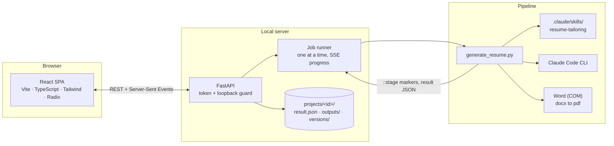

# Resume Studio

**Truthful resumes, tailored to every job posting.** Resume Studio takes the career
history you already have (a resume plus a profile of accomplishments) and tailors
it to one specific job posting with Claude, then verifies every number, citation,
and claim before a single file is written. Everything runs locally; generation uses
your Claude subscription through the Claude Code CLI.

<p>
  
  
</p>

*Screenshots use a fictional demo persona (`examples/demo_data.py`).*

## What it does

- **Paste a job posting, get a tailored resume.** A project per application keeps the
  posting, the tailored resume (Word and PDF), every earlier version, and your
  application status and notes.
- **Nothing is invented.** Employers, titles, and dates are copied from your base
  resume exactly. Claude only selects, orders, and rephrases material that exists in
  your own documents, and deterministic checks enforce it:
  - every bullet cites the fact-bank facts it is built from, and a bullet that
    borrows another employer's fact is dropped;
  - numbers are checked against your materials;
  - a never-claim list (credentials, role identities, tools you don't use) blocks
    the render outright.
- **Edit with live guardrails.** Drag bullets to reorder, rewrite freely, and see
  flagged lines while you type. Ctrl+S re-renders the Word and PDF files in seconds,
  with no new Claude call.
- **Three ATS-safe templates.** Classic, Modern, and Compact are all single column,
  with standard fonts and nothing in headers or footers. Switching is instant.
- **See how well it matches.** Keyword coverage lists the posting's terms that you
  genuinely have, and which of them the resume uses. Missing terms are honest gaps,
  never prompts to claim something new.
- **Upload any resume.** PDF or Word. It is parsed deterministically (with an
  optional one-shot Claude extraction for unusual layouts), and anything not found
  word-for-word in your file is flagged for review before it's saved.
- **Day and night themes**, a Ctrl+K command palette, background jobs with live
  progress, version compare and restore, and a setup wizard.

<p>
  
  
</p>
<p>
  
  
</p>

## Quick start (Windows)

1. Install **Python 3.10+** ([python.org](https://www.python.org/downloads/), tick
   "Add python.exe to PATH") and **Node.js** ([nodejs.org](https://nodejs.org/)).
2. Install and sign in to the **Claude Code CLI**:
   ```bash
   npm install -g @anthropic-ai/claude-code
   ```
   ```bash
   claude /login
   ```
3. Double-click **`Launch Resume Studio.bat`**.

The first launch creates a private Python environment (`.venv`) and builds the web
app, which takes a few minutes. After that it opens in your browser in seconds. Keep
the console window open while you use it; close it to stop the app.

Microsoft Word is used to export PDFs. Without it you still get `.docx` files. To
put a shortcut on your desktop, run `scripts/create_desktop_shortcut.ps1` once.

**Other platforms / developers:** `pip install -r requirements.txt`, then
`python launcher.py` (add `--dev` for Vite hot reload on port 5173).

**Try it with demo data** (a fictional persona, no Claude calls needed to explore):

```bash
python scripts/make_demo_workspace.py
```
```bash
python launcher.py --data-root demo_workspace
```

## How it works



- **The pipeline stays the single source of truth.** The app keeps your inputs in
  the exact files the command-line pipeline reads (`resume_input/in_profile*.docx`,
  `in_resume*.docx`, `fact_bank.yaml`, `do_not_claim.txt`), and runs
  `generate_resume.py` as a subprocess for every generation and re-render. The
  tailoring rules live only in the `resume-tailoring` skill.
- **Generation** is a drafting call plus a narrow JSON transcription call, followed by
  deterministic validation (citations, cross-employer mentions, numbers, em dashes,
  the never-claim list, keyword coverage). The result is saved as editable JSON.
- **Re-rendering** (`--render-json`) re-runs the same guards on your edited content
  and writes the files without calling Claude, so template switches and hand edits
  are instant and free.
- **Security for a local app:** the server binds to 127.0.0.1, rejects non-loopback
  Host headers (DNS rebinding), and requires a per-launch token on every API call.

Code map: `studio/` (API, project store, resume ingestion, fact bank, live linting,
job runner), `webapp/frontend/` (React app), `generate_resume.py` (pipeline),
`launcher.py` and `Launch Resume Studio.bat` (startup). See [CLAUDE.md](CLAUDE.md) for
internals.

## Command-line use

The original CLI still works on its own, with `resume_input/` as the inputs and
`resume_create/` / `resume_archive/` as the outputs:

```bash
python generate_resume.py
```

| Flag | What it does |
|------|--------------|
| `--job PATH` | Tailor to this posting instead of the newest `resume_input/in_job*` file |
| `--profile`, `--resume`, `--fact-bank`, `--deny` | Use these input files instead of the defaults |
| `--template {classic,modern,compact}` | Resume layout (default: classic) |
| `--cover-letter` | Also write a cover letter, held to the same citation and never-claim checks |
| `--out-dir`, `--archive-dir` | Where outputs and superseded outputs go |
| `--result-json PATH` | Also save the structured, editable result |
| `--render-json PATH` | Re-validate and render a saved result without calling Claude |
| `--model M`, `--effort E` | Override `CLAUDE_MODEL` / `CLAUDE_EFFORT` |
| `--no-pdf`, `--dry-run`, `--archive-job` | Skip PDF export / write nothing / archive the posting after a run |

Optional inputs: `resume_input/fact_bank.yaml` (draft it with
`python build_fact_bank.py`, then edit by hand or in the app) and `do_not_claim.txt`
(one case-insensitive regex per line). Optional `.env` settings: `CLAUDE_MODEL`,
`CLAUDE_EFFORT`, `CLAUDE_TIMEOUT`.

## Your data

Everything stays on your computer in plain files: `resume_input/` (inputs),
`projects/` (one folder per application), `resume_archive/` (automatic backups of
every profile, resume, and fact-bank save). All of these are git-ignored, so career
data is never committed.

## Development

```bash
pip install -r requirements-dev.txt
```
```bash
python -m pytest -q
```
```bash
cd webapp/frontend && npm install && npm run check
```

- `npm run check` runs TypeScript, ESLint, and Vitest.
- `npm run gen:api` regenerates `src/lib/api-schema.d.ts` from the server's Pydantic
  models, so frontend and backend types can't drift.
- `python scripts/make_template_previews.py` re-renders the template thumbnails
  (needs Word).
- `python scripts/capture_screenshots.py` retakes these screenshots against a
  running demo workspace and fails if any page scrolls sideways on a phone.

No test makes a Claude call; the API tests swap in a fake pipeline script.

## Troubleshooting

- **"Claude CLI needs you to sign in"**: run `claude /login` in a terminal, then
  generate again.
- **"The Claude Code CLI wasn't found"**: install it (step 2 above), then restart
  Resume Studio so it picks up the new PATH.
- **No PDF, only a .docx**: PDF export needs Microsoft Word on Windows.
- **A file is "locked, most likely open in Word"**: close it in Word and retry.
- **The page says the web app hasn't been built**: run the launcher again (it builds
  automatically when Node.js is installed), or `npm run build` in `webapp/frontend`.
